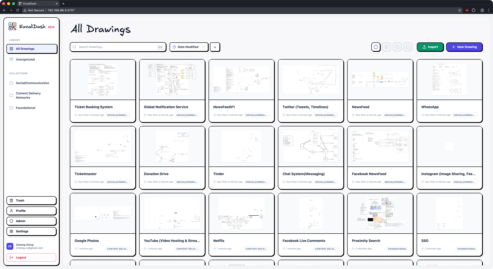
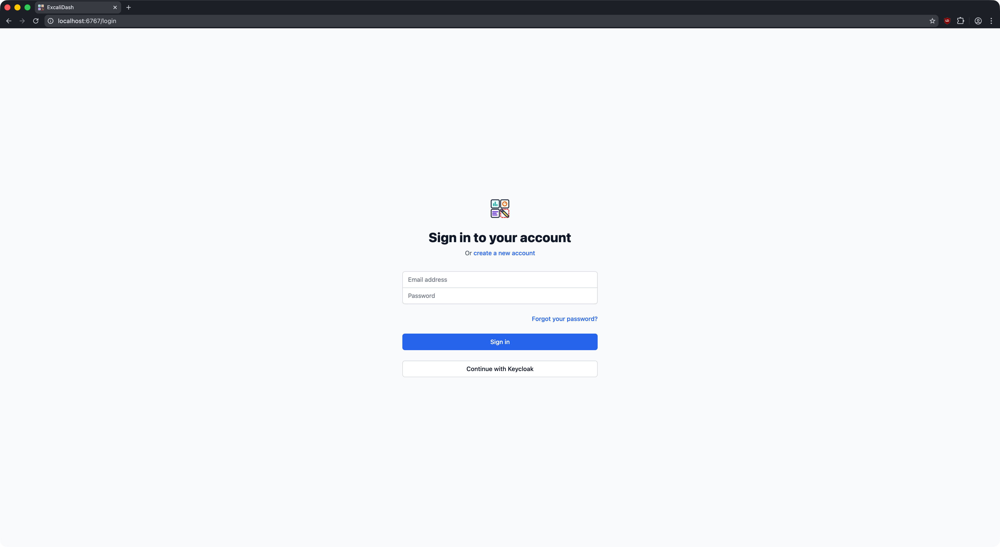
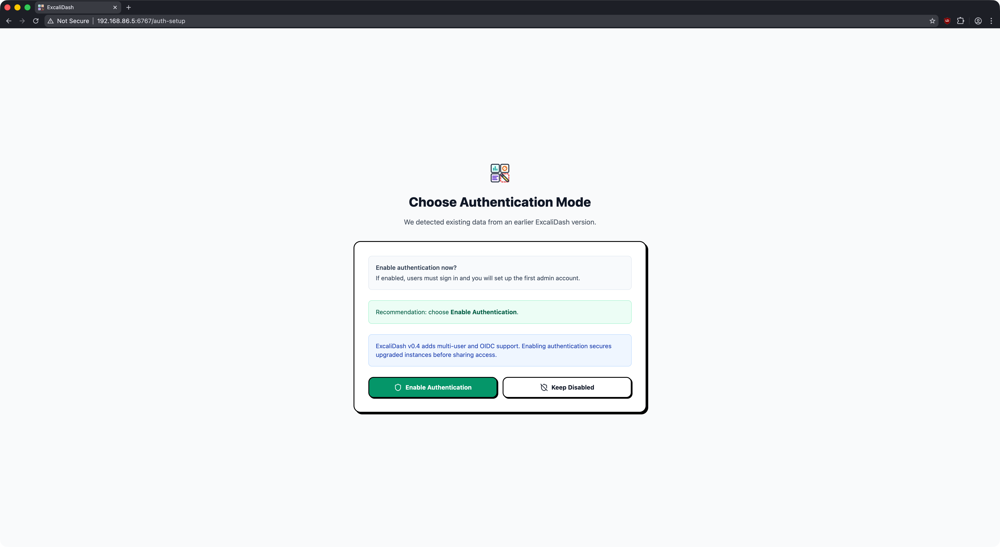
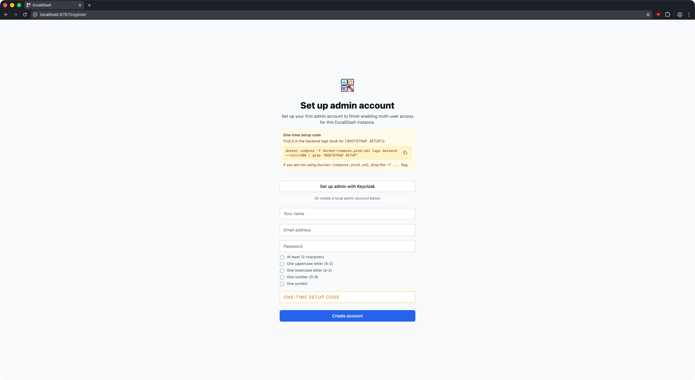
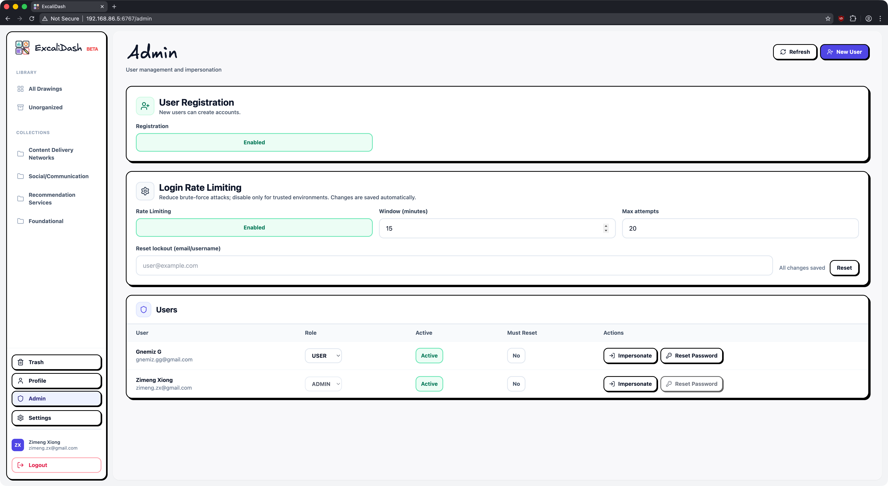
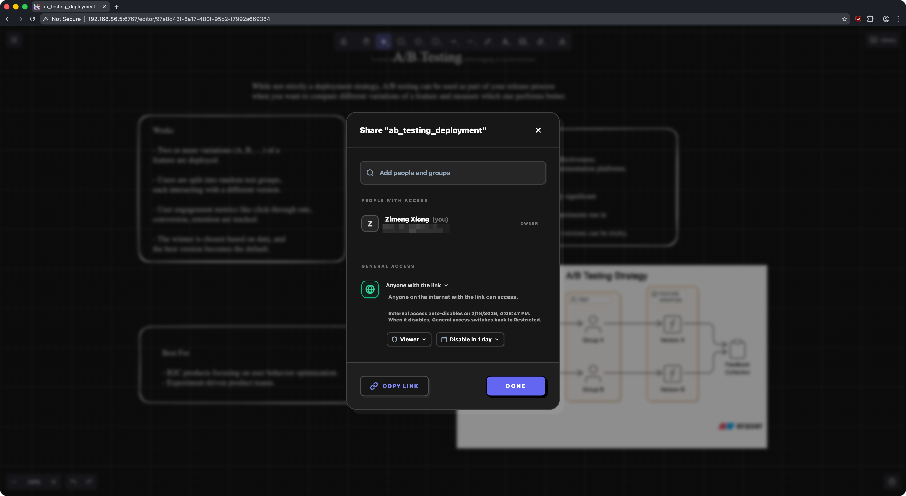
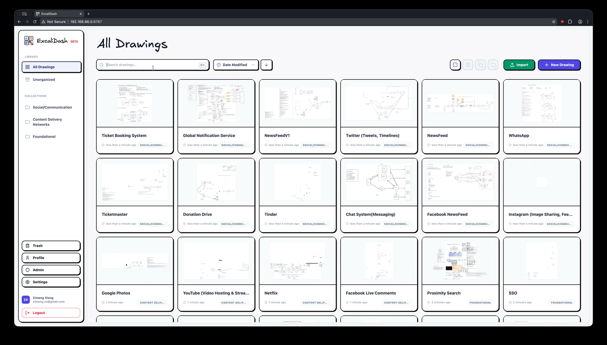

# ExcaliDash


[](https://hub.docker.com)

A self-hosted dashboard and organizer for [Excalidraw](https://github.com/excalidraw/excalidraw) with live collaboration features.


## Table of Contents

- [Features](#features)
- [Upgrading](#upgrading)
- [Installation](#installation)
  - [Quickstart](#quickstart)
  - [Advanced](#advanced)
- [Development](#development)
- [Credits](#credits)

## Features

<details>
<summary>Persistent storage for all your drawings</summary>



</details>

<details>
<summary>Real time collaboration</summary>


</details>

<details>
<summary>(Optional) Multi User Authentication, OIDC Support</summary>

### Sign in with OIDC



### Migration from v0.3



### Admin Bootstrap



### Admin Dashboard



</details>

<details>
<summary>Scoped internal & external sharing</summary>



</details>
<details>
<summary>Search your drawings</summary>



</details>

<details>
<summary>Drag and drop drawings into collections</summary>


</details>

<details>
<summary>Export/import your drawings for backup</summary>

### Excalidash uses a non-proprietary archival format that stores your drawings in plain .excalidraw format


</details>

# Upgrading

See [release notes](https://github.com/ZimengXiong/ExcaliDash/releases) for a specific release.

ExcaliDash includes an in-app update notifier that checks GitHub Releases. If your deployment must not make outbound network calls, disable it on the backend:

```bash
UPDATE_CHECK_OUTBOUND=false
```

## Docker Hub Upgrades

If you deployed using `docker-compose.prod.yml` (Docker Hub images), upgrade by pulling the latest images and recreating containers:

```bash
docker compose -f docker-compose.prod.yml pull && \
  docker compose -f docker-compose.prod.yml up -d
```

If you prefer a clean stop/start (more downtime, but simpler), you can do:

```bash
docker compose -f docker-compose.prod.yml down && \
  docker compose -f docker-compose.prod.yml pull && \
  docker compose -f docker-compose.prod.yml up -d
```

Notes:

- Don’t add `-v` to `down` unless you intend to delete the persistent backend volume (your SQLite DB + secrets).
- Only add `--remove-orphans` if you previously ran a different Compose file for the same project name and need to remove old/renamed services.

# Installation

> [!CAUTION]
> This is a pre-release feature and production-readiness depends on deployment controls:
> use TLS, trusted reverse proxy, fixed secrets, backups, and endpoint rate limits.

> [!CAUTION]
> ExcaliDash is in BETA. Please backup your data regularly.

## Quickstart

Prereqs: Docker + Docker Compose v2.

<details>
<summary>Docker Hub (Recommended)</summary>

## Docker Hub (Recommended)

```bash
# Download docker-compose.prod.yml
curl -OL https://raw.githubusercontent.com/ZimengXiong/ExcaliDash/main/docker-compose.prod.yml

# Pull images
docker compose -f docker-compose.prod.yml pull

# Run container
docker compose -f docker-compose.prod.yml up -d

# Access the frontend at localhost:6767
```

For single-container deployments, `JWT_SECRET` can be omitted and will be auto-generated and persisted in the backend volume on first start. For portability and most production deployments, set a fixed `JWT_SECRET` explicitly.

By default, the provided Compose files set `TRUST_PROXY=false` for safer setup. Only set `TRUST_PROXY` to a positive hop count (for example, `1`) when requests always pass through a trusted reverse proxy that correctly sets forwarded headers.

</details>

<details>
<summary>Docker Build</summary>

## Docker Build

```bash
# Clone the repository (recommended)
git clone git@github.com:ZimengXiong/ExcaliDash.git

# or, clone with HTTPS
# git clone https://github.com/ZimengXiong/ExcaliDash.git

docker compose build
docker compose up -d

# Access the frontend at localhost:6767
```

</details>

## Advanced

<details>
<summary>Reverse Proxy / Traefik</summary>

When running ExcaliDash behind Traefik, Nginx, or another reverse proxy, configure both containers so that API + WebSocket calls resolve correctly:

| Variable       | Purpose                                                                                                                                                                   |
| -------------- | ------------------------------------------------------------------------------------------------------------------------------------------------------------------------- |
| `FRONTEND_URL` | Backend allowed origin(s). Must match the public URL users access (for example `https://excalidash.example.com`). Supports comma-separated values for multiple addresses. |
| `TRUST_PROXY`  | Set to `1` when traffic passes through one trusted reverse-proxy hop (for example frontend nginx -> backend) and headers are sanitized.                                   |
| `BACKEND_URL`  | Frontend container-to-backend target used by Nginx. Override when backend host differs from default service DNS/host.                                                     |

```yaml
# docker-compose.yml example
backend:
  environment:
    # Single URL
    - FRONTEND_URL=https://excalidash.example.com
    # Trust exactly one reverse-proxy hop
    - TRUST_PROXY=1
    # Or multiple URLs (comma-separated) for local + network access
    # - FRONTEND_URL=http://localhost:6767,http://192.168.1.100:6767,http://nas.local:6767
frontend:
  environment:
    # For standard Docker Compose (default)
    # - BACKEND_URL=backend:8000
    # For Kubernetes, use the service DNS name:
    - BACKEND_URL=excalidash-backend.default.svc.cluster.local:8000
```

</details>

<details>
<summary>Scaling / HA (Current Limitations)</summary>

ExcaliDash currently supports running **one backend instance**.

Why:

| Area          | Limitation                                                                                                                                                                                                                                                                                        |
| ------------- | ------------------------------------------------------------------------------------------------------------------------------------------------------------------------------------------------------------------------------------------------------------------------------------------------- |
| Database      | The backend uses a local **SQLite file** database by default (`DATABASE_URL=file:/.../dev.db`). Running multiple backend replicas either creates split-brain state (separate DB files/volumes) or requires sharing a single SQLite file across hosts, which is not a reliable deployment pattern. |
| Collaboration | Real-time presence state is tracked **in-memory** in the backend process, so multiple replicas will fragment presence/collaboration unless a shared Socket.IO adapter is added.                                                                                                                   |

Recommended deployment pattern:

| Component | Guidance                                                                |
| --------- | ----------------------------------------------------------------------- |
| Backend   | 1 replica, persistent volume, regular backups.                          |
| Frontend  | 1 replica is simplest; scaling is generally fine since it is stateless. |

</details>

<details>
<summary>Auth, Onboarding, and First Admin Setup</summary>

ExcaliDash supports local login and OIDC, and includes a one-time first-admin bootstrap key to protect initial setup/migration flows.

Auth modes:

| `AUTH_MODE`       | Behavior                                                       |
| ----------------- | -------------------------------------------------------------- |
| `local` (default) | Native email/password login only.                              |
| `hybrid`          | Native login plus OIDC login.                                  |
| `oidc_enforced`   | OIDC-only login (`/auth/register` and `/auth/login` disabled). |

If you upgrade and see an onboarding/setup flow, follow the UI. For emergency-only operator access, you can temporarily bypass the onboarding gate:

```bash
DISABLE_ONBOARDING_GATE=true docker compose -f docker-compose.prod.yml up -d
```

One-time first-admin bootstrap setup code (local auth only):

| What             | Notes                                                                                |
| ---------------- | ------------------------------------------------------------------------------------ |
| When required    | Auth enabled and no active users (fresh install or certain migrations).              |
| Where to find it | Backend logs: `[BOOTSTRAP SETUP] One-time admin setup code ...`.                     |
| Behavior         | Single-use; if you enter an invalid/expired code, check logs for the refreshed code. |

Find the current code in logs:

```bash
docker compose -f docker-compose.prod.yml logs backend --tail=200 | grep "BOOTSTRAP SETUP"
```

OIDC configuration (for `hybrid` / `oidc_enforced`) requires these backend env vars:

```yaml
backend:
  environment:
    - AUTH_MODE=oidc_enforced
    - OIDC_PROVIDER_NAME=Authentik
    - OIDC_ISSUER_URL=https://auth.example.com/application/o/excalidash/
    - OIDC_CLIENT_ID=your-client-id
    # Optional for public clients; required for confidential clients
    # - OIDC_CLIENT_SECRET=your-client-secret
    - OIDC_REDIRECT_URI=https://excalidash.example.com/api/auth/oidc/callback
    - OIDC_SCOPES=openid profile email
```

Notes:

| Topic                       | Notes                                                                                                                         |
| --------------------------- | ----------------------------------------------------------------------------------------------------------------------------- |
| OIDC-only (`oidc_enforced`) | You typically do not use local bootstrap admin registration; first admin can be created through your IdP depending on config. |
| Reverse proxy               | Set `FRONTEND_URL` and `TRUST_PROXY` correctly or auth + websockets may fail.                                                 |

</details>

<details>
<summary>Local OIDC Test Stack (Docker + Keycloak)</summary>

### Local OIDC Test Stack (Docker + Keycloak)

This repo includes a Keycloak container + realm seed for local OIDC testing:

- Compose file: `docker-compose.oidc.yml`
- Realm import: `oidc/keycloak/realm-excalidash.json`

The realm seed intentionally contains **no users and no passwords**. You create a realm user and set a password via the Keycloak admin UI.

Start Keycloak:

```bash
# From repo root
# Choose a strong password; do not commit it.
export KEYCLOAK_ADMIN_PASSWORD='...'
docker compose -f docker-compose.oidc.yml up -d
```

Open Keycloak admin UI (realm/user setup):

- `http://localhost:8080/admin`
- Switch realm to `excalidash`
- Create a user and set a password in `Credentials`

Configure ExcaliDash backend for hybrid OIDC:

```bash
cd backend
cp .env.oidc.example .env
# Ensure OIDC_REDIRECT_URI matches where your frontend is running:
# - http://localhost:6767/api/auth/oidc/callback (repo frontend dev default)
# - https://excalidash.example.com/api/auth/oidc/callback (production)
```

Stop/clean up:

```bash
docker compose -f docker-compose.oidc.yml down
```

</details>

<details>
<summary>Configuration (Backend Environment Variables)</summary>

Base values are documented in `backend/.env.example`. Common ones to care about:

| Variable       | Default / Example         | Description                                                                         |
| -------------- | ------------------------- | ----------------------------------------------------------------------------------- |
| `DATABASE_URL` | `file:/app/prisma/dev.db` | SQLite file or external DB URL.                                                     |
| `FRONTEND_URL` | `http://localhost:6767`   | Allowed frontend origin(s), comma-separated for multiple entries.                   |
| `TRUST_PROXY`  | `false`                   | `false`, `true`, or hop count (for example `1`).                                    |
| `JWT_SECRET`   | `change-this-secret...`   | Recommended in production so sessions remain stable across restarts and migrations. |
| `CSRF_SECRET`  | `change-this-secret`      | Recommended in production so CSRF validation remains stable across restarts.        |
| `AUTH_MODE`    | `local`                   | `local`, `hybrid`, `oidc_enforced`.                                                 |

</details>

# Development

<details>
<summary>Clone the Repository</summary>

## Clone the Repository

```bash
# Clone the repository (recommended)
git clone git@github.com:ZimengXiong/ExcaliDash.git

# or, clone with HTTPS
# git clone https://github.com/ZimengXiong/ExcaliDash.git
```

</details>

<details>
<summary>Frontend</summary>

## Frontend

```bash
cd ExcaliDash/frontend
npm install

# Copy environment file and customize if needed
cp .env.example .env

npm run dev
```

</details>

<details>
<summary>Backend</summary>

## Backend

```bash
cd ExcaliDash/backend
npm install

# Copy environment file and customize if needed
cp .env.example .env

# Generate Prisma client and setup database
npx prisma generate
npx prisma db push

npm run dev
```

</details>

<details>
<summary>Simulate Auth Onboarding (Development)</summary>

### Simulate Auth Onboarding (Development)

To simulate first-run authentication choice flows in local development:

```bash
cd ExcaliDash/backend

# Preview what would change (no data modifications)
npm run dev:simulate-auth-onboarding:dry-run

# Simulate "fresh install" onboarding state
# (wipes drawings/collections/libraries and removes non-bootstrap users)
npm run dev:simulate-auth-onboarding:fresh

# Simulate "migration" onboarding state (ensures legacy data exists)
npm run dev:simulate-auth-onboarding:migration
```

After running a simulation while the backend is already running, wait about 5 seconds
(auth mode cache TTL) or restart the backend before refreshing the UI.

</details>

<details>
<summary>Setup and Operational Scripts</summary>

### Setup and Operational Scripts

In `backend/package.json` there are helper scripts for maintenance:

| Script          | Purpose                                    |
| --------------- | ------------------------------------------ |
| `admin:recover` | Emergency admin credential recovery/reset. |

Admin recovery example:

```bash
cd backend
npm run admin:recover -- --identifier admin@example.com --generate --activate --must-reset
```

Common flags:

| Flag                          | Description                                              |
| ----------------------------- | -------------------------------------------------------- |
| `--password "<new-password>"` | Set explicit new password.                               |
| `--generate`                  | Generate a secure random password.                       |
| `--activate`                  | Activate the admin account immediately.                  |
| `--promote`                   | Promote user to admin role.                              |
| `--must-reset`                | Force password reset on first login.                     |
| `--disable-login-rate-limit`  | Temporarily disable login throttling for this operation. |

</details>

# Credits

- Example designs from:
  - https://github.com/Prakash-sa/system-design-ultimatum/tree/main
  - https://github.com/kitsteam/excalidraw-examples/tree/main
- [The amazing work of Excalidraw & contributors](https://www.npmjs.com/package/@excalidraw/excalidraw)
