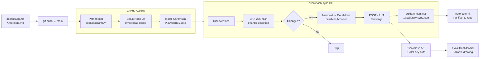

# Sync Pipeline

How mermaid diagram files in external repos are automatically converted and pushed to ExcaliDash on every push to main.

```mermaid
flowchart LR
    Files[docs/diagrams\n*.mermaid.md]
    Push[git push → main]

    subgraph GHA[GitHub Actions]
        Trigger[Path trigger\ndocs/diagrams/**]
        Node[Setup Node 20\n@roofailab scope]
        Playwright[Install Chromium\nPlaywright 1.58.2]
    end

    subgraph CLI[excalidash-sync CLI]
        Discover[Discover files]
        Hash[SHA-256 hash\nchange detection]
        Check{Changed?}
        Convert[Mermaid → Excalidraw\nheadless browser]
        UPSERT[POST · PUT\n/drawings]
        Manifest[Update manifest\n.excalidraw-sync.json]
    end

    API[ExcaliDash API\nX-API-Key auth]
    Board[ExcaliDash Board\nEditable drawing]
    Commit[Auto-commit\nmanifest to repo]

    Files --> Push
    Push --> Trigger
    Trigger --> Node --> Playwright --> CLI

    Discover --> Hash --> Check
    Check -->|yes| Convert
    Check -->|no| Skip[Skip]
    Convert --> UPSERT --> Manifest

    UPSERT --> API --> Board
    Manifest --> Commit
```
