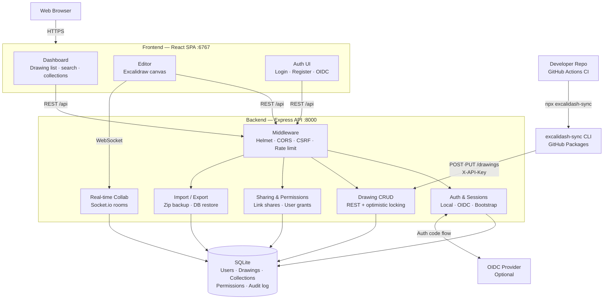

# System Overview

High-level architecture of ExcaliDash — web frontend, Express backend, SQLite storage, real-time collaboration, and the CI sync pipeline for external repos.

```mermaid
flowchart TD
    Browser[Web Browser]
    DevRepo[Developer Repo\nGitHub Actions CI]

    subgraph Frontend[Frontend — React SPA :6767]
        Dashboard[Dashboard\nDrawing list · search · collections]
        Editor[Editor\nExcalidraw canvas]
        AuthUI[Auth UI\nLogin · Register · OIDC]
    end

    subgraph Backend[Backend — Express API :8000]
        Middleware[Middleware\nHelmet · CORS · CSRF · Rate limit]
        AuthRoutes[Auth & Sessions\nLocal · OIDC · Bootstrap]
        DrawingAPI[Drawing CRUD\nREST + optimistic locking]
        CollabWS[Real-time Collab\nSocket.io rooms]
        SharingAPI[Sharing & Permissions\nLink shares · User grants]
        ImportExport[Import / Export\nZip backup · DB restore]
    end

    DB[(SQLite\nUsers · Drawings · Collections\nPermissions · Audit log)]
    OIDCProvider[OIDC Provider\nOptional]
    SyncCLI[excalidash-sync CLI\nGitHub Packages]

    Browser -->|HTTPS| Frontend
    DevRepo -->|npx excalidash-sync| SyncCLI

    Dashboard -->|REST /api| Middleware
    Editor -->|REST /api| Middleware
    Editor -->|WebSocket| CollabWS
    AuthUI -->|REST /api| Middleware

    Middleware --> AuthRoutes
    Middleware --> DrawingAPI
    Middleware --> SharingAPI
    Middleware --> ImportExport

    AuthRoutes --> DB
    AuthRoutes <-->|Auth code flow| OIDCProvider
    DrawingAPI --> DB
    CollabWS --> DB
    SharingAPI --> DB
    ImportExport --> DB

    SyncCLI -->|POST·PUT /drawings\nX-API-Key| DrawingAPI
```
