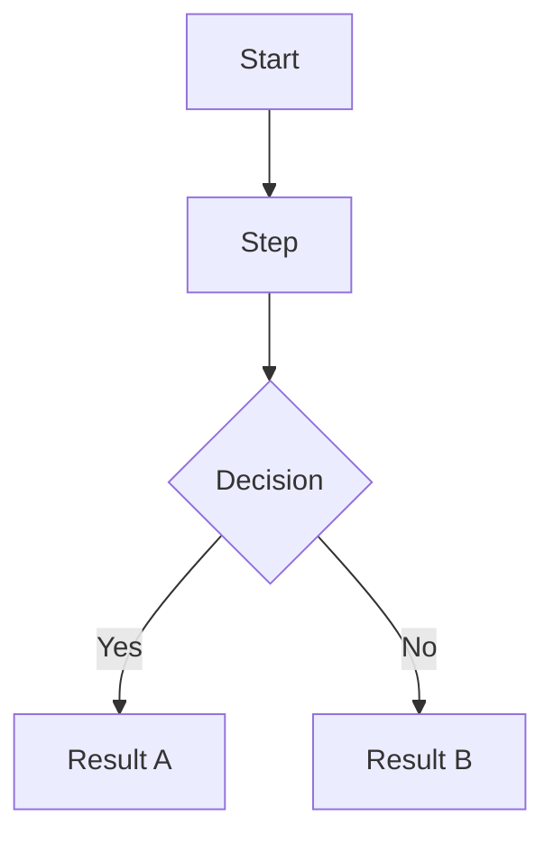

## Diagrams

Architecture and flow diagrams live in `docs/diagrams/` as `*.mermaid.md` files.
They are automatically synced to ExcaliDash on push via CI.

If no system overview diagram exists, create one:

> "Generate a high-level architecture diagram for this codebase as a Mermaid flowchart.
> Save it to docs/diagrams/system-overview.mermaid.md following the file format in the spec."

Rules:
- Use `flowchart TD` — other diagram types render as non-editable images
- File naming: kebab-case, e.g. `auth-flow.mermaid.md`, `data-pipeline.mermaid.md`
- First `#` heading becomes the diagram title on ExcaliDash
- One mermaid block per file
- Prefer flowcharts over sequence/class diagrams for architecture

File format:

```markdown
# Diagram Title

Brief description of what this diagram represents.


```
